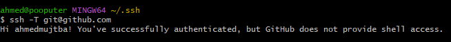
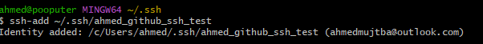

# tech230_github_ssh

Follow the steps below to setup SSH keys on github.

### In Terminal:

1. In home directory, run `cd .ssh`. If no such directory, add `mkdir .ssh`
2. `ssh-keygen -t rsa -b 4096 -C "youremail@email.com"` - Creates a public/private SSH key pair.
3. When prompted to add username, run `yourname_github_ssh` to name your key.
4. When prompted to add a passphrase, add a passphrase or press `Enter`

NOTE: Make sure to add the key to the authenitcation agent using the command below:

`sh-add /Users/ahmedmujtba/.ssh/<name-of-your-key>`

### In Github

5. Go to `settings` and select `SSH and GPG keys`.
6. Select `new ssh key` -

### In Terminal

7. Run `cat yourkeyname.pub` and copy the `key` that appears.

### In Github

8. Paste the copied ssh key and add the same name as one in bash.

### In Terminal

7. Run `ssh -T git@github.com`. This should show message as follows:

8. Run `ssh-agent -s`.

9. Run `ssh-add ~/.ssh/yourname_github_ssh`
